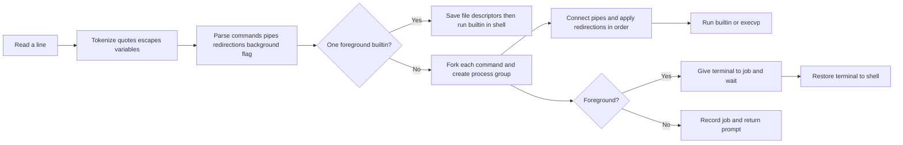

# Shell architecture

`parser.c` produces a bounded `Pipeline` structure with up to 16 commands, 64 arguments per command, and 16 redirections per command. `executor.c` calls `pipe`, `fork`, `setpgid`, `dup2`, `open`, `execvp`, `waitpid`, and `tcsetpgrp`. Redirections apply left to right after pipe connections, so `> file 2>&1` sends both streams to the file. For a standalone builtin, descriptors 0–2 are saved and restored around the builtin so `pwd > file` does not redirect later prompts.

`builtin.c` handles commands that change shell state in the shell process. The `cd -` command uses the previous directory. `export` validates variable names and uses `setenv`, so children inherit values. `shell.c` holds the history ring and job table. The shell ignores interactive terminal signals; children restore default signal behavior. A SIGCHLD handler sets a flag; the main loop reaps children with `waitpid` outside the handler.

Known limits are listed in the README. The shell does not attempt general POSIX shell compatibility. The parser reports malformed pipelines and redirections instead of executing a partial command.
